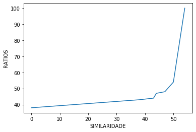
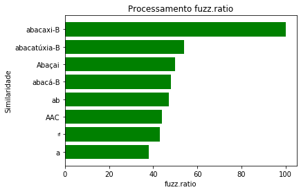

# Análise-desempenho-py
O trabalho faz parte do programa de pós-graduação em Ciência da Computação da Unisinos. Aqui você pode encontrar a avaliação de um sistema especialista (SE), utilizando de algoritmos que façam pesquisa de string difusa, combinação de strings difusas é a técnica de encontrar strings que correspondam aproximadamente a um padrão (em vez de exatamente). Em outra palavra, a correspondência de string difusa é um tipo de pesquisa que encontrará correspondências mesmo quando os usuários digitarem palavras incorretamente ou inserirem apenas palavras parciais para a pesquisa. Também é conhecido como correspondência aproximada de strings. Aqui você encontrará uma abordagem para resolução do problema usando algoritmo de Levenshtein frequentemente utilizado para calcular a distância entre duas strings.

## Índice
- Pré-requisitos
- Instruções ao usuário
- Cenário
- Analise de desempenho
  - Definição das métricas de desempenho
  - Carga para teste de algoritmo 
  - Performance de métricas
  - Análise de algoritmo
  - Conclusões
- Autores

## Pré-requisitos
   - Python 3
   - Fuzzywuzzy
   - Python-Levenshtein
   - Numpy
   - Matplotlib
   - Json
   - Timeit
   - Psutil
   - Statistics

## Instruções ao usuário
A base de dados utilizada no projeto será em arquivo tipo JSON, um formato que armazena informações estruturadas e principalmente usado para transferir dados entre um servidor e um cliente. O arquivo e basicamente uma alternativa simples e mais leve ao XML (Extensive Markup Language), que tem funções similares. Desenvolvedores usam o JSON para trabalhar com AJAX (Asynchronous JavaScript and XML). A distância de Levenshtein é uma métrica para medir a distância entre duas sequencias de palavras. Em outras palavras, ele mede o número mínimo de edições que você precisa fazer para alterar uma sequência de uma palavra na outra. Essas edições podem ser inserções, exclusões ou substituições. Para regenerar testes e gráficos a partir de novas análises, execute o arquivo [https://github.com/elielalbuquerque/analise-desempenho-py/blob/main/Levensntein.py](Algoritmo de Levenshtein).

## Cenário
Com base numa string de dados informada pelo usuario numa aplicação console python, desejamos comparar a similaridade com palavras armazenadas em uma base e trazer a informações que melhor representa com maior nível de similaridade.
  - Importar biblioteca FuzzyWuzzy, uma função de razão que calcula a razão de similaridade de distância de Levenshtein padrão entre duas sequências e demais bibliotecas listadas no item pre-requisitos.

### Objetivo
Comparar o desempenho entre as funções Ratios, Partial_Ratio, Token_Sort_Ratio, Token_Set_Ratio, presentes na biblioteca Fuzzywuzzy, para resolver o problema de comparação de similaridade de duas strings com maior nível de similaridade. 
  
# Análise de desempenho
Nesta seção iremos avaliar o desempenho de nossas propostas de algoritmos para resolver o SE codificado aqui. Discutiremos sobre o desempenho das quatro propostas de funções presentes e implementadas: Ratios, Partial_Ratio, Token_Sort_Ratio, Token_Set_Ratio. 
A técnica utilizada para avaliação será a de simulação usando como critério a precisão para comparação.

## Definição das métricas de desempenho
Duas métricas foram escolhidas para analisar o desempenho de ambas as funções. O primeiro é o tempo de execução, o segundo o numero de palavras de um dataset. 
1. Tempo de execução
2. Quantidade de registro no dataset
3. Ratio (min)
4. Ratio (med)
5. Ratio (man)

### Carga para teste de algoritmo
- Testaremos cargas de trabalho para busca de palavras num dicionario de 29.857 e 167.192 palavras. 
As palavras pesquisadas usarão como base palavras armazenados no formato json conforme arquivo [Lista-de-Palavras.json](Lista de Palavras) e [Lista-de-Palavras2.json](Lista de Palavras)

### Performance de metricas
- Ratios/similaridade

### Análise dos algoritmos
Para executar a análise de ambos os algoritmos, execute Levenshtein.py, ele calcula a similaridade da string informada e o tempo para encontrar na base contendo 29.857 e 167.192 palavra. 
A string de referência usada para produzir os dados abaixo foi:

Opção 1: **ABACAXI** - 29.857 palavras

Opção 2: **abacaxi** - 167.192 palavras

| Algoritmo     | Dataset |Execução | Ratio Min.| Ratio Med. | Ratio Max. |  Dicionario |
| --            | --      | --      | --        | --         | --         | --          |
| Ratio         | 29.857  | 3,22s   | 21        | 31,16      | 48         | PT_BR       |
| Partial_Ratio | 29.857  | 11,10s  | 43        | 66         | 100        | PT_BR       | 
| Token_Sort    | 29.857  | 3,61s   | 36        | 48,75      | 64         | PT_BR       |
| Token_set     | 29.857  | 4,01s   | 36        | 57,75      | 100        | PT_BR       |
| Ratio         | 167.192 | 12,49s  | 09        | 28,2       | 45         | PT_BR       |
| Partial_Ratio | 167.192 | 33.71s  | 20        | 61         | 100        | PT_BR       | 
| Token_Sort    | 167.192 | 24,14s  | 38        | 47,75      | 58         | PT_BR       |
| Token_set     | 167.192 | 24,76s  | 38        | 53         | 100        | PT_BR       |

Para executar a análise do algoritmo, execute Levensntein.py, ele calcula os passos médios e o tempo para resolver a similaridade de acordo com as opções 1 e opção 2 listadas em Análise de Algoritmo. Para cada função aplicamos os datasets X e Y, disponíveis nos links [Lista-de-Palavras.json](Lista de Palavras) e [Lista-de-Palavras2.json](Lista de Palavras), a saída desses cálculos estão na tabela acima.

### Análise do resultado do Ratio
Nos gráficos abaixo podemos ver que até o nível de similaridade 

## Conclusões
Neste documento foi exemplificado como a correspondência por aproximada de strings e determinar o quão semelhante são. Os exemplos apresentados aqui podem ser simples, mas são suficientes para ilustrar como lidar com vários casos do que um computador pensa serem strings incompatíveis através da correspondência de string difusa para mapear correspondentes a pesquisa de um sistema de turismo para recomendação. No entanto, a utilidade desta técnica pode ser expandida, não há limites para usos da correspondência difusa. Este trabalho tem como objetivo demostrar os resultados de performance e acurácia comparando dois algoritmos distintos com o mesmo objetivo de comparar a similaridade entre palavras informadas com uma base de dados existentes.
